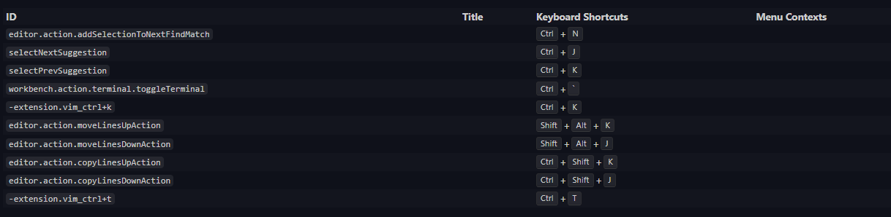

# vimanco

Its a shoaib's keybindings for Visual Studio Code based on Vim Extension.


## Keybindings



## Installation

Vimanco can be installed via the VS Code [Marketplace](https://marketplace.visualstudio.com/items?itemName=shoaibashk.vimanco). Or from Vscode CLI

```shell
code --install-extension shoaibashk.vimanco
```

## Local Installation

```sh
vsce package
code --install-extension vimanco-{version}.vsix
```

## Development

```sh
gulp updateVersion --ver {versionNumber} # no 'v' letter before or after.
```

Create a PR then merge it with `main` branch.

```sh
#On main branch ->
git tag -l
git tag v0.0.6
git push origin v0.0.6
```

## For more information

**Enjoy!**
